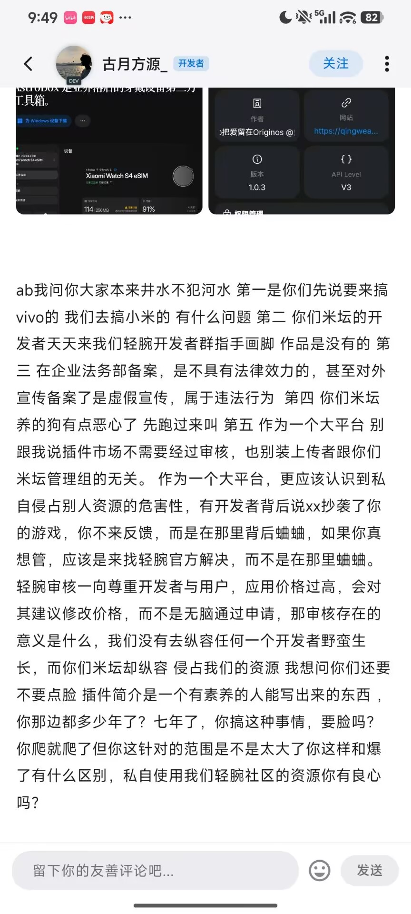

# MiBand_WorldWar

## 关于一战 ⟪AstroBox大战轻腕⟫
### 时间
`2026 06/28` ~ `2026 07/01`
### 起因
因为[这个PR](https://github.com/AstralSightStudios/AstroBox-NG-Plugin-Repo/pull/3)的关系，导致AstroBox被上架了[这个东西](https://github.com/AstralSightStudios/AstroBox-NG-Plugin-Repo/commit/26dd44823c1b4e1edb914aaa89edf83b9ceb6cf8)，导致轻腕社区那边反应很大

以下是相关图片
> 
### 和解
AstroBox 率先发出和解书：
[原文出处点此查看](https://www.bandbbs.cn/threads/27140/)
> 关于插件
> AstroBox 的插件系统自设计之初便以完全的自由、开放与无监管为目标，因此插件能否上架市场的唯一审核标准是「不对用户设备造成危害」。基于这一标准，我们此前审核通过并允许了插件「轻腕社区源」上架。
> 近期，该插件的相关功能在社区之间引发了激烈冲突。为避免事态进一步升级至不可控的局面，我们已对该插件以及其他具有相同性质功能的插件进行下架处理，并就第三方插件上架审核过程中考虑不周一事致歉。同时也对此第三方插件侵犯对方社区利益表示抱歉。
> 需要说明的是，由于 AstroBox 插件商城在架构设计上对自由与无监管的追求，我们仅能从索引层面移除该插件，无法直接干预其作者自有的产物仓库与[源码仓库](https://github.com/Leakrooms/PowerfulPlugins)。因此，我们仍无法限制用户之间的私下传播及后续的进一步开发，对此深表遗憾。
> 
> 关于语言冲突
> 此次冲突的起因，是轻腕社区宣布推出 OrbitM 工具，其目标功能为向小米穿戴设备安装第三方资源。随后，多名社区开发者通过逆向工程分析发现，该工具中包含来自开源项目 GadgetBridge 的相关代码与文件，且未遵循该项目所要求的 AGPL-v3 协议。问题被指出后，轻腕社区侧已及时进行调整，并按协议要求实施了补救措施。
> 然而在此过程中，双方社区的用户与创作者之间仍出现了语言冲突，言辞激烈、失当，甚至具有侮辱性；更有部分管理层人员（包括社区运营）带头下场、挑起争端。而前述「轻腕社区源」插件的上架，也在客观上起到了火上浇油的作用。
> 对此，我们认为双方均负有共同过错。经沟通，双方一致认为此类行为本不应发生。在此，我们谨代表 AstroBox 侧，就我方用户及创作者在冲突中的过激、失当言论向轻腕社区侧致歉；轻腕社区侧亦就其成员及管理人员的相关言行向我方致歉。同时，双方约定收回在各公共平台（包括但不限于 B 站、轻腕社区、米坛社区、AstroBox 评论区等）发表的不当言论并删除相关内容，就此前不尊重对方创作者、不尊重对方项目的行为公开致歉。
> 
> 关于版权问题
> 经双方协商，就相关事项达成如下共识：
> 1. 轻腕社区侧此前就[OrbitM 发布的相关声明](https://qingwear.top/post/sYrJVq)将予以保留、不作删除，并在公开道歉公告中再次明确承认此前对开源协议使用不当的事实。
> 2. 轻腕社区侧将对相关表盘工具的模板进行下架处理。
> 3. 今后双方如发现资源侵权问题，应通过各自平台的官方渠道相互举报，不得故意不予处理或故意拒绝受理；若双方均无法判定资源归属，则建议交由相关资源的原始创作者之间私下协商解决。双方将共同维护良好的社区氛围。
> 
> 关于社区关系与后续
> 1. 双方承诺，不拒绝、不刻意针对对方社区的创作者入驻本方平台，并支持其适配、发布资源的正常行为。
> 2. 双方将先各自整理声明内容，在互相确认内容妥当后，于公开位置同时发布官方声明，并在各自声明末尾同时引用对方声明。

这是轻腕社区的和解书：
[原文出处点此查看](https://qingwear.top/post/UexGXV)
> 轻腕社区和解致歉声明
> 
> 为终结双方争议、达成友好和解，轻腕社区特此公开声明如下：
> 
> 1. 我方将永久保留 [OrbitM 相关公示文章](https://qingwear.top/post/sYrJVq)不予删除，并承认我方过往在开源协议使用与引用方面存在不当、不规范的问题，对此郑重致歉。
> 2. 我方即日起全网收回所有针对 AstroBox 的负面言论，并撤回一切不尊重 AstroBox 开发团队及双方创作者的不当发言。将主动清理B站、社群、社区、评论区等所有平台相关争议内容，就此前不当言论与不尊重行为公开致歉。
> 3. 此前我方更换、整理创作群的行为并非针对、清算米坛及 AstroBox 原创创作者，仅为清理混入创作群的非创作无关人员。因事前未充分说明造成外界误会，我方就此致歉。
> 4. 我方将即刻下架站内相关表盘工具模板资源，杜绝衍生纠纷。
> 5. 后续双方平台若发现跨站资源侵权，须通过官方正规渠道相互举报、正常处理，不得故意拖延或拒绝处置；版权归属无法判定时，交由创作者双方自行协商解决，共同维护良好社区生态。
> 6. 我方承诺：不拒绝、不刻意针对 AstroBox、米坛创作者入驻、适配及发布资源，尊重创作者跨平台自由。
> 
> 此次冲突的原因在于对方无故上架了我们的轻腕社区资源库，严重损害我方的利益。因此双方爆发了语言冲突。我们双方都有做的不对的地方。经过协商，双方各自收回自己的不当言论。共同打造一个良好的穿戴设备生态。
> 本次致歉仅针对我方言行不当与开源使用不规范问题，保留我方合理维权立场。双方自此纠纷终结，互不追责、不再引战，共同维护良性创作环境。
> 
> 轻腕社区
## 关于二战 ⟪破解浪潮⟫
### 时间
`2023 10月` ~ `2024 6月`,`2026 7月` ~ `现在`
### 起因
#### 1. 表盘白嫖
详见[此](http://www.shaoxingsx.jcy.gov.cn/yasf/202506/t20250626_7011927.shtml)

对于上述一战过的相关群聊，均以贴出以下公告：

> 请勿对外传播所谓“免费使用小米付费表盘”等非正规方法。 小米曾在小米手环8等设备中研究并实施了对第三方表盘的禁用机制，相关实例可见于固件版本1.6.208。在该版本中，即使通过海外修改版小米运动健康、Notify For Xiaomi 或表盘自定义工具等途径，亦无法安装第三方表盘，仅能通过官方应用商店获取正式表盘。这表明小米具备技术能力限制非官方表盘的加载与使用。小米有能力将相关机制应用到其它存量可穿戴设备。为避免因追求短期微小利益而导致整个第三方表盘市场受损，恳请各位自觉遵守相关规定， 共同维护良好的开发与使用环境。感谢大家的理解与支持。
> 在本群中若出现任何「为什么安装的表盘回到小米运动健康就消失了」相关问题，我会给你十分钟时间禁言，请你自己琢磨反思表盘怎么来的，没有付费购买的表盘就在那边跟个小偷一样偷过来用还在那边说是正规途径来的，我不知道你是傻还是什么。
> 同时，本群不允许以任何形式传播所谓「免费使用小米官方表盘方法」，一旦发现立即踢出并拉入黑名单。丑话说在前头，不要觉得自己这么干很大义很高尚，等小米法务真正清算起来能让你倾家荡产。其他品牌亦有类似案例，建议好好品鉴一下处罚你够不够格承担
#### 2. 快应用破解
于`2026 7/20`前后，有人发现小米手环的`JSC`加密其实就是[2021 3月27日的quickjs](https://github.com/zeroli/quickjs-2021-03-27-annotation)，此人宣称可找他代购，就在后一天，Y社发布了一篇[帖子](https://pd.qq.com/s/78pf61bvk?b=2)，然后当事人就变成`AI黑客`的代名词了
## 关于三战 ⟪地图快应用版权⟫
[高德：授权了吗就用我API赚钱](https://lbs.amap.com/pages/terms/)
### 时间
`2026 08/29` ~ `现在`
### 起因
[Velvetine的地图](https://github.com/Velvetine13245/WristMap)与另一位疑似登记版权用来圈钱的[Ning Map](https://nsof.top/resource.php?id=52)高度相似，其背后皆为高德地图API
